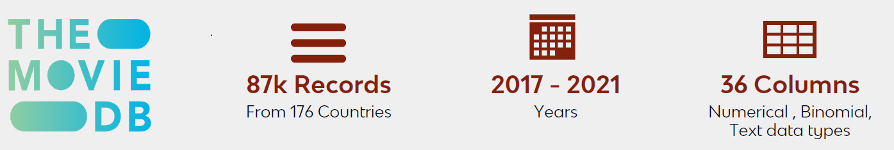
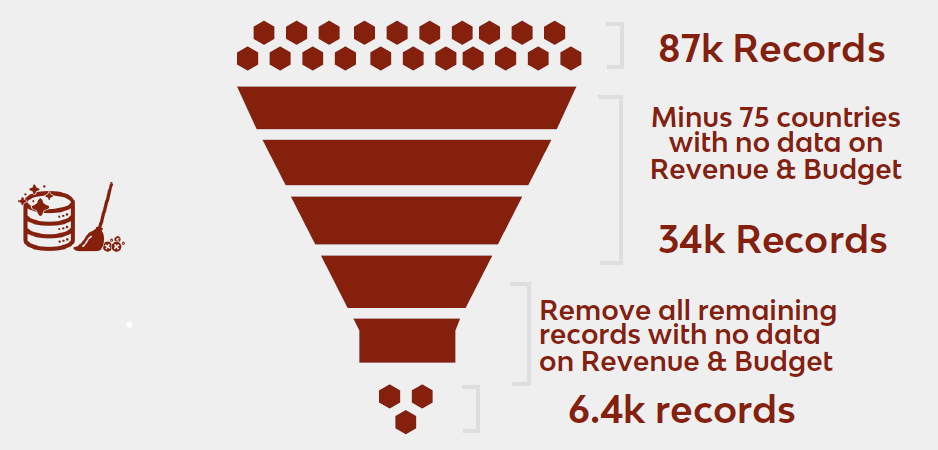

# Predicting-Movie-success
A project that is intended to classify movies to be released as Blockbuster, good &amp; unsuccessful movies based on their profitability. 

## Project Overview:

**This Project is broken into xxx Sections.**'
+ [Section 1: Data Sourcing](https://github.com/ajithgh/Predicting-Movie-success/tree/main/Data%20Sourcing)
+ [Section 2: Coding in R](https://github.com/ajithgh/Predicting-Movie-success/blob/main/README.md#section-2-coding-in-r)
+ [Section 3: Summary of Recomendations & COnclusions]()

-----

## [Section 1: Data Sourcing](https://github.com/ajithgh/Predicting-Movie-success/tree/main/Data%20Sourcing)

For this project, we have used [The Movie Database](https://www.themoviedb.org/documentation/api?language=en-US) API, popularly known as TMDB Data. 
The Data Scrapped from TMDB, then acted as our Primary Data with over 87k records just from 5 years between 2017-2021. 



We then funneled the data using Heuristics and Logical approach.
+ Fileter 1: We aggregated Revenue and budget over countrires 
```bash
countriesRevbud <-aggregate( x = df_movies[c("revenue","budget")],
                     by = list(df_movies$production_countries),
                     FUN = "mean")
```
+ Filter 2: Then we dropped all the records with both revenue and Budget = 0 using subset technique. This is because, we primarily used **Profitablity** to classify movies into successful or unsuccessful movies.  
```bash
df_movies <- subset(df_movies, (df_movies$revenue!=0 | df_movies$budget!=0))
```



After Data Funneling, we were left with 6.4k records. We then augmented this Dataset using [IMDB Data](https://www.imdb.com/interfaces/) to add IMDB ratings & IMDB Vote Counts. This is an Open source data and is availabnle on IMDB. 

We then merged this Data using VBA coding and Vlookup in Excel. This can also be done easily using Inner Join in R. 


-----


## [Section 2: Coding in R](https://github.com/ajithgh/Predicting-Movie-success/tree/main/Rcodes)

This section can be used on various Data Sources involving the same features. You may also use it on an updated/larger Datasets from TMDB and/or IMDB. Please, pay caution to column names. 

**Further, This Project Code is Broken into 4 Parts:**
+ [Part 0: Data Overview, Funneling and Cleaning](www)
+ [Part 1: Exploratory Data Analysis](https://github.com/ajithgh/Predicting-Movie-success/blob/main/Rcodes/Part%201:%20EDA.R)
+ [Part 2: Data Enhancement (Imputation, Feature Engineering, Dummifying), Building models and Prediction](https://github.com/ajithgh/Predicting-Movie-success/blob/main/Rcodes/Part%202:%20Models%20without%20revenue.Rmd)
+ [Part 3: Trend & Sentiment Analysis on Reviews, Overview & Keywords using Text Analytics (Seperately on Successful and Unsuccessful Movies)](https://github.com/ajithgh/Predicting-Movie-success/blob/main/Rcodes/Part%203:%20Trend%20&%20Sentiment%20Analytics.Rmd)


Click on the above codes to go to respective code files or use the [Master Code](https://github.com/ajithgh/Predicting-Movie-success/blob/main/Rcodes/Master%20Code%20File.Rmd) file to get the complete codes along with Live links to data files initially used in this project. 

---- 

## [Section 3: Conclusion](https)

In This section, you can find an idea as to how you can interpret the findings of this Project. Further, you can also subset based on genres or Top earning Genres and then find the important factor within. 
Please see our [Presentation deck here](https://github.com/ajithgh/Predicting-Movie-success/blob/main/Images/BA_Final_Project_size_reduced.pdf)


 
